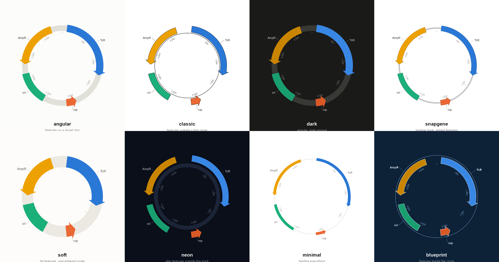
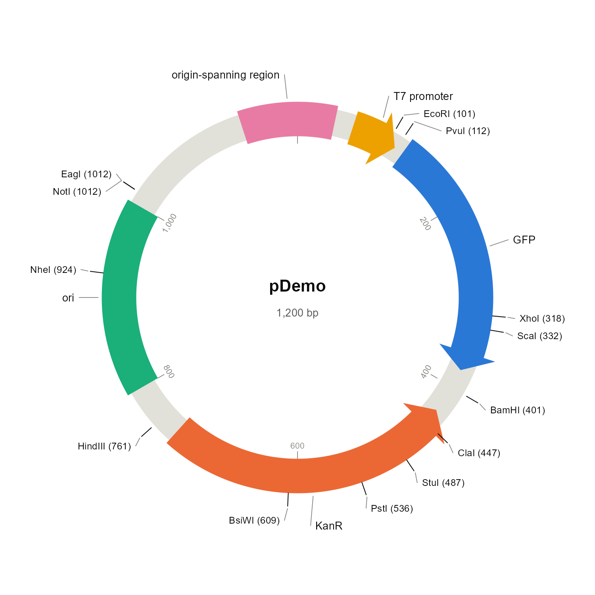
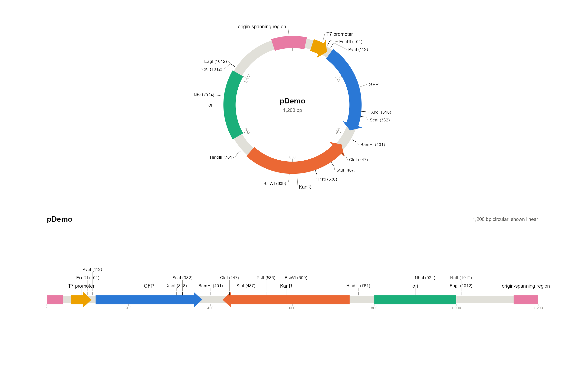
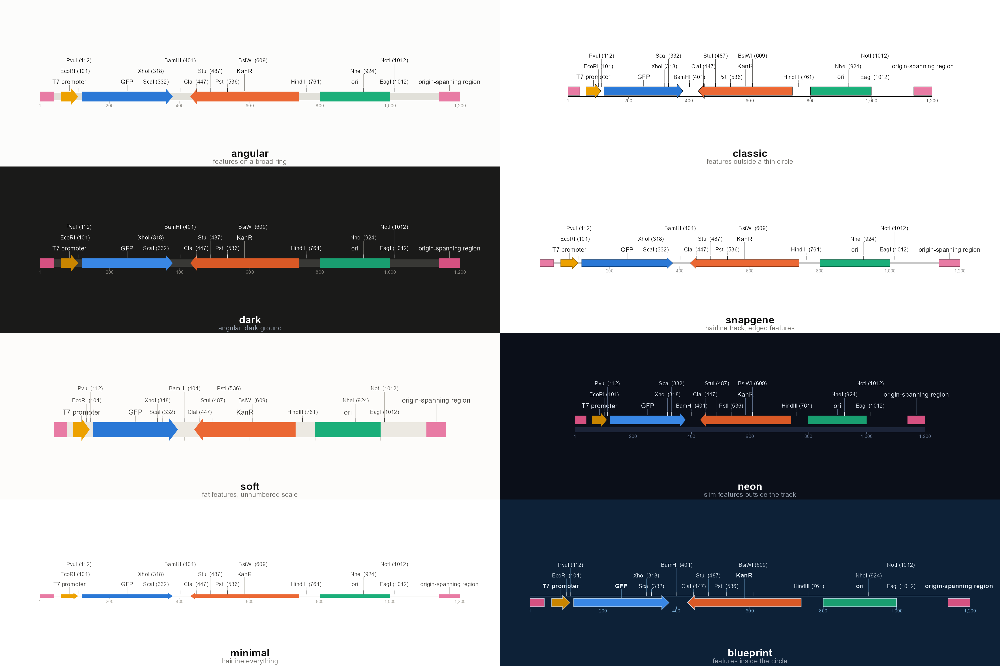
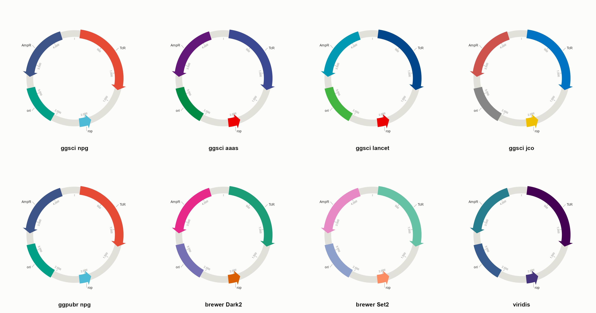
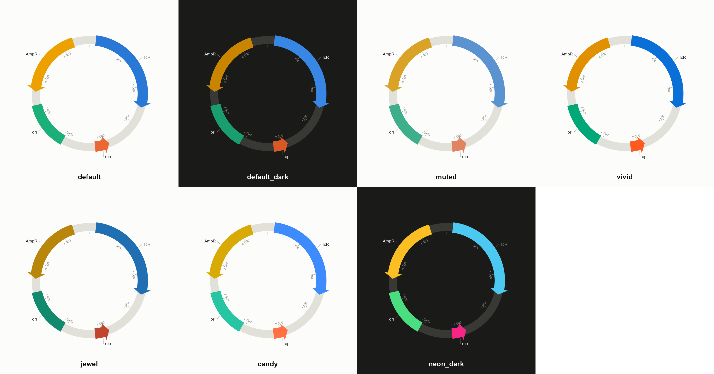

# plasmidplot

用 R 绘制出版级环形质粒图谱。风格灵感来自 [AngularPlasmid](https://github.com/vixis/angularplasmid)，核心用 base R + grid 实现。

**风格（style）和配色（palette）是两个独立维度**，可以任意组合。风格本身由**七个形状参数**构成，预设只是这些参数的常用组合——预设能做到的，你都能手写出来：

| 参数 | 作用 |
|---|---|
| `layout` | `"auto"`（按质粒拓扑自动选）/ `"circular"` / `"linear"` |
| `anchor` | 特征弧的位置：`"center"` 压在骨架上 / `"outside"` 外侧 / `"inside"` 内侧 |
| `backbone` | `"ring"` 带状骨架 / `"line"` 单线 / `"none"` 不画 |
| `radius` | 地图占多大：环形是骨架半径，线性是横向半宽 |
| `track` | 骨架厚度 |
| `arc` | 特征弧厚度 |
| `gap` | `anchor` 非居中时，特征与骨架的间距 |

```r
# 完全不用预设，直接组合形状参数
plot(p, style = pp_style(anchor = "outside", backbone = "line",
                         radius = 0.26, arc = 0.05))

# 或从预设出发改一处
plot(p, style = pp_style("angular", arc = 0.09))
plot(p, style = pp_style("minimal", layout = "linear"))
```



*八种风格，颜色固定不变（浅底用 `default`，深底用 `default_dark`）。每个预设是一套独立的构造，不是换色版——它们在特征弧相对骨架的位置、骨架与弧的粗细、有无描边、刻度的显隐上都不同。*

## 特性

- 🧬 **环形与线性**两种布局，按质粒拓扑自动选择
- 🔧 风格由七个正交的形状参数构成（`layout` `anchor` `backbone` `radius` `track` `arc` `gap`），预设只是常用组合
- 📥 导入 **GenBank / EMBL / FASTA / SnapGene / 纯序列**，按文件内容自动识别
- ✂️ **限制性酶切位点**：内置 46 种常用酶，自动搜索并标注单切位点
- 🎨 8 种风格 + 7 组配色，所有字段可自定义
- 🌈 **直接支持 ggsci / ggpubr / RColorBrewer / viridis 等外部配色**，并可用 `pp_check_palette()` 检查其色觉安全性
- 🏷️ 特征标签与位点标签**统一布局**，互不压盖
- ➡️ 箭头为单一闭合路径，**没有接缝**；支持正向 / 反向 / 双向
- ↩️ 支持跨越原点（origin）的特征和酶切位点
- 🖼️ **样式不绘制底色**，画进任何背景都不会被覆盖
- ♿ 全部内置配色通过色盲安全性验证

## 安装

```r
devtools::install("i:/plasmidplot")
```

## 快速开始

```r
library(plasmidplot)

p <- plasmid("pBR322", 4361) |>
  pp_marker(86, 1276,   label = "TcR",  arrow = "end") |>
  pp_marker(1915, 2106, label = "rop",  arrow = "start") |>
  pp_marker(2535, 3122, label = "ori") |>
  pp_marker(3293, 4153, label = "AmpR", arrow = "start")

plot(p)
```

批量添加用 `pp_features()`：

```r
plot(pp_features(plasmid("pBR322", 4361), data.frame(
  start = c(86, 2535, 3293),
  end   = c(1276, 3122, 4153),
  label = c("TcR", "ori", "AmpR"),
  arrow = c("end", "none", "start")
)))
```

## 导入文件

```r
p <- read_plasmid("x.gb")     # 按内容识别格式，推荐
p <- read_genbank("x.gb")     # GenBank
p <- read_embl("x.embl")      # EMBL
p <- read_fasta("x.fa")       # FASTA / 纯序列（只有骨架，无特征）
p <- read_snapgene("x.dna")   # SnapGene（需要 xml2）
```

`read_plasmid()` **不看扩展名，只看内容**——`.dna` 既可能是 SnapGene 二进制，也可能是纯序列文本，甚至存成 `.txt` 的 GenBank 记录都能正确识别。

解析内容包括：名称 / 长度 / 拓扑、`complement(...)` 链方向、`join(...)` 跨原点特征、`<`/`>` 部分边界、SnapGene 的双向特征（画成双箭头）。序列默认保留在 `p$sequence`，供酶切搜索使用；若序列长度与头部声明不符（文件被截断），会**拒绝采用并警告**，避免位置换算全错。

```r
read_genbank("x.gb",
  types      = "CDS",          # 只保留指定类型
  skip_types = "source",       # 丢弃指定类型
  label_from = c("label", "gene", "product"),  # 标签取值优先级
  color_by   = "feature",      # "feature" 每个特征独立配色；"type" 同类型同色
  colors     = "style",        # "file" 则沿用文件里存的颜色
  sequence   = TRUE            # 是否保留序列
)
```

## 限制性酶切位点

```r
p <- read_plasmid("pDemo.gb")
p <- pp_find_sites(p)                          # 全部单切酶
p <- pp_find_sites(p, c("EcoRI", "BamHI"))     # 指定酶
p <- pp_find_sites(p, c(MyEnz = "GGWCC"))      # 自定义识别序列（支持 IUPAC 简并码）
plot(p)
```



默认只标注**单切酶**（`unique_only = TRUE`）——这是经典质粒图的惯例，切十几刀的酶除了把图淹没在标签里没有任何信息量。要放宽用 `unique_only = FALSE, max_sites = 3`。环形质粒会自动搜索跨原点的位点。

`pp_enzymes()` 查看内置酶表；也可以手工加单个位点：`pp_site(p, 396, "EcoRI")`。

## 风格

`pp_style()` 无参调用列出全部预设。每个预设**就是**下面这组形状参数加上颜色，没有藏起来的东西：

| 预设 | anchor | backbone | radius | track | arc | 底色 | 默认配色 |
|---|---|---|---|---|---|---|---|
| `angular` | center | ring | 0.30 | 0.045 | 0.058 | 浅 | `default` |
| `classic` | **outside** | line | 0.26 | 0.045 | 0.050 | 浅 | `default` |
| `snapgene` | center | ring | 0.30 | 0.012 | 0.042 | 浅 | `default` |
| `minimal` | center | line | 0.30 | 0.045 | 0.022 | 浅 | `default` |
| `soft` | center | ring | 0.28 | 0.090 | 0.090 | 浅 | `muted` |
| `dark` | center | ring | 0.30 | 0.045 | 0.058 | 深 | `default_dark` |
| `blueprint` | **inside** | line | 0.33 | 0.045 | 0.050 | 深 | `default_dark` |
| `neon` | **outside** | ring | 0.25 | 0.030 | 0.050 | 深 | `neon_dark` |

`dark` 和 `angular` 形状相同是刻意的——它就是 angular 为深底重新取色的版本。

## 环形与线性

`layout` 默认 `"auto"`：环状质粒画环形图，线性分子画线性图，跟随对象的 `topology`（导入时自动解析）。也可以强制：

```r
plot(p, style = pp_style("angular", layout = "linear"))
```



同一个质粒、同一个风格，两种布局。**七个形状参数在两种布局下含义一致**——`anchor = "outside"` 在环形是向外、在线性是向上；`radius` 在环形是半径、在线性是横向半宽——所以风格切换布局后仍认得出来（下图里 `neon` 最窄、`blueprint` 最宽，正是 radius 0.25 和 0.33 的差别）：



线性布局下：跨原点的特征会拆成首尾两段绘制（环状分子才有的东西，线性图上诚实地画成两块）；标签按需要自动叠成多行，不会挤在一行上重叠；刻度和数字在下方，标签和酶切位点在上方。

"默认配色"只是预设自带的选择，不是绑定的——任意风格都能配任意配色：

```r
plot(p, style = pp_style("minimal",  palette = "jewel"))
plot(p, style = pp_style("blueprint", palette = "neon_dark"))
```

**样式不会绘制底色**——设备或外层 viewport 的背景会透过来，所以画进拼版、Rmd、已有画布里都不会被一块白矩形盖掉。深色预设需要深色底才能看清，用 `pp_canvas()` 取它设计时的底色：

```r
plot(p, style = "neon", bg = pp_canvas("neon"))

# 或者让设备提供背景
ragg::agg_png("x.png", width = 1400, height = 1400, res = 220,
              background = pp_canvas("dark"))
plot(p, style = "dark"); dev.off()
```

以预设为基础按名覆盖任意字段：

```r
plot(p, style = pp_style("angular",
  palette        = "jewel",
  arc            = 0.07,      # 特征弧厚度
  arc_border     = "auto",    # 自动取填充色的深色版做描边
  label_fontsize = 11,
  tick_every     = 1000,
  arrow_deg      = 8,
  site_len       = 0.03       # 酶切位点刻度长度
))
```

完整字段见 `?pp_style`。

## 配色

### 用外部配色（ggsci / ggpubr / RColorBrewer / viridis…）

`palette` 接受三种形式：内置名称、**任意颜色向量**、或**函数**。ggsci、RColorBrewer、scales、viridis 暴露的都是"给 n 返回 n 个颜色"的函数形式，所以直接放进去就行，不需要任何适配代码：

```r
plot(p, style = pp_style("angular", palette = ggsci::pal_npg("nrc")))
plot(p, style = pp_style("angular", palette = ggsci::pal_lancet()))
plot(p, style = pp_style("angular", palette = RColorBrewer::brewer.pal(8, "Dark2")))
plot(p, style = pp_style("angular", palette = ggpubr::get_palette("npg", 8)))
plot(p, style = pp_style("angular", palette = viridisLite::viridis))
plot(p, style = pp_style("angular", palette = c("#E64B35", "#4DBBD5", "#00A087")))
```



传函数比传固定向量更好：函数会被**按实际需要的颜色数**调用，所以 12 个特征就拿到 12 个不同的颜色，而固定的 8 色向量会循环重复。如果函数供不上（ggsci 多数封顶在 10 色），会明确警告而不是悄悄重复。

### 检查你带来的配色

`pp_check_palette()` 用**和内置配色完全相同的算法与阈值**（Machado 2009 色觉模拟 + OKLab ΔE + WCAG 对比度）检查任意配色：

```r
pp_check_palette(ggsci::pal_npg("nrc"), n = 8)
#>   [FAIL] Lightness band        outside L 0.43-0.77: #F39B7FFF (0.772), #91D1C2FF (0.813)
#>   [FAIL] Chroma floor          reads gray: #3C5488FF (0.090), #8491B4FF (0.054), ...
#>   [PASS] CVD separation        worst #4DBBD5FF vs #00A087FF dE 12.4 (deutan), tritan 10.3
#>   [FAIL] Normal-vision floor   worst #4DBBD5FF vs #00A087FF dE 13.3 - below 15, ...
#>   [WARN] Contrast vs surface   below 3:1, needs visible labels: ...
#>   -> NOT SAFE: Normal-vision floor failed. ...
```

输出区分两类问题：**CVD 区分度**和**正常视力区分下限**决定读者能不能把两个特征分开，挂了就是真不安全；其余三项只影响观感是否统一，挂了说明颜色仍然可读，只是没落在内置配色遵守的亮度/彩度区间里。

值得一提的实测结果：8 色时几乎所有流行配色都过不了至少一项。ggsci npg 的 `#4DBBD5`（青）和 `#00A087`（绿松石）正常视力 ΔE 只有 13.3，brewer Set2 连 CVD 区分度都是 FAIL。所以内置的 7 组仍然有存在价值——它们是**逐对验证过的默认值**，而不是又一份好看的色号清单。

### 内置配色



*七组配色，风格固定为 `angular`（深色底的两组只换了墨色和轨道色，几何完全一致）。*

| 配色 | 适用底色 | 验证结果 |
|---|---|---|
| `default` | 浅色 | 全部门槛通过（含对比度） |
| `default_dark` | 深色 | 全部门槛通过 |
| `jewel` | 浅色 | 全部门槛通过（含对比度） |
| `vivid` | 浅色 | 区分度门槛全通过 |
| `candy` | 浅色 | 区分度门槛全通过 |
| `muted` | 浅色 | 区分度下限通过；最接近的一对需配合文字标签 |
| `neon_dark` | 深色 | 对比度与区分度门槛通过 |

名称以 `_dark` 结尾的配色是为深色底重新取阶的，放在浅底上会发灰。配色名与风格名**不会重名**（有测试锁住这条），所以 `pp_style("neon")` 和 `pp_style(palette = "neon_dark")` 不会再混淆。

每组都用色觉模拟（红/绿/蓝色盲）逐对验证过，**槽位顺序本身就是安全机制**，请按给定顺序取色。开发中砍掉了几组近邻色系配色（全棕、全蓝，以及模仿 SnapGene 原生色板的一组），因为相邻特征在红绿色盲下 ΔE 低到 1.3~3.3，基本无法区分。

## 关于非 ASCII 标签（希腊字母 / 中文）

标签支持任意 Unicode（如 `lacZα`、`卡那霉素抗性`），但 **Windows 自带的 `png()` 设备在非 UTF-8 locale 下会渲染失败**。请改用 ragg 或 cairo 设备：

```r
ragg::agg_png("plasmid.png", width = 1400, height = 1400, res = 220)
plot(p); dev.off()

svglite::svglite("plasmid.svg", width = 6, height = 6); plot(p); dev.off()
grDevices::cairo_pdf("plasmid.pdf", width = 6, height = 6); plot(p); dev.off()
```

## API 一览

| 函数 | 作用 |
|---|---|
| `plasmid(name, length)` | 创建质粒对象 |
| `pp_marker(p, start, end, ...)` | 添加特征弧（管道友好） |
| `pp_features(p, df)` | 从 data.frame 批量添加 |
| `pp_site(p, position, label)` | 添加单点位点 |
| `pp_find_sites(p, enzymes)` | 从序列搜索酶切位点 |
| `pp_enzymes()` | 内置酶表 |
| `read_plasmid()` | 按内容识别格式导入 |
| `read_genbank()` / `read_embl()` / `read_fasta()` / `read_snapgene()` | 指定格式导入 |
| `plot(p, style, bg)` | 绘图 |
| `pp_style(preset, ...)` | 构建/自定义风格；无参列出预设 |
| `pp_canvas(style)` | 取风格设计时的底色 |
| `pp_palette(name)` | 取内置配色；无参列出全部 |
| `pp_check_palette(colors)` | 检查任意配色的色觉安全性与对比度 |
| `pp_demo(style)` / `pp_demo_plasmid()` | 内置示例 |

`pp_marker()` 说明：

- `arrow`：`"end"` 顺时针（正链）、`"start"` 逆时针（负链）、`"both"` 双向、`"none"` 无
- `end < start` 表示特征跨越原点
- `group` 让同组特征共用一个调色板颜色
- `offset` 径向偏移，用于错开重叠特征

## 拼版

`newpage = FALSE` 可以画进已有 viewport：

```r
grid::grid.newpage()
grid::pushViewport(grid::viewport(layout = grid::grid.layout(1, 2)))
grid::pushViewport(grid::viewport(layout.pos.col = 1))
plot(p1, newpage = FALSE); grid::popViewport()
grid::pushViewport(grid::viewport(layout.pos.col = 2))
plot(p2, newpage = FALSE); grid::popViewport()
```

## 仓库里的图

`man/figures/` 下每张图只变化一个维度，其余固定，并在说明里写明固定了什么。全部由 `dev/figures.R` 一个脚本生成，改了代码重跑一次即可，不会出现互相矛盾的旧图：

| 文件 | 内容 | 固定不变的是 |
|---|---|---|
| `styles-circular.png` | 8 种风格，环形 | 颜色（`default` / `default_dark`） |
| `styles-linear.png` | 同样 8 种风格，线性 | 颜色，以及质粒本身 |
| `layouts.png` | 环形 vs 线性 | 风格与颜色 |
| `palettes.png` | 7 组内置配色 | 风格（`angular`） |
| `palettes-external.png` | 8 组外部包配色 | 风格（`angular`） |
| `sites.png` | 酶切位点标注 | — |
| `import.png` | 从 GenBank 导入的结果 | — |

`dev/` 下的其他脚本：`make-fixtures.R` 生成 `inst/extdata` 的测试数据（序列与酶切位点由代码保证一致），`verify-checker.R` 对照校验 `pp_check_palette()` 的数值，`summary.R` 打印各预设的形状参数表。

## Roadmap

- [ ] 多轨道（multi-track）支持
- [ ] GC content / GC skew 环
- [ ] 酶切位点按识别序列长度分级显示

## License

MIT
